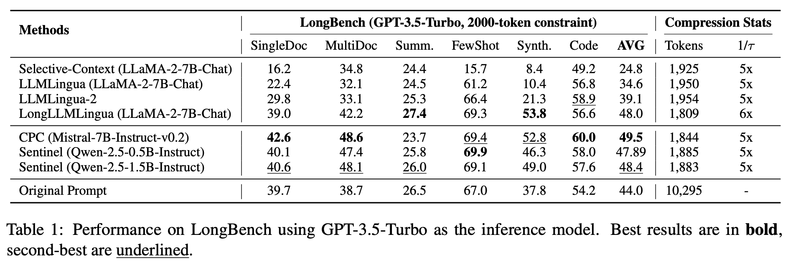
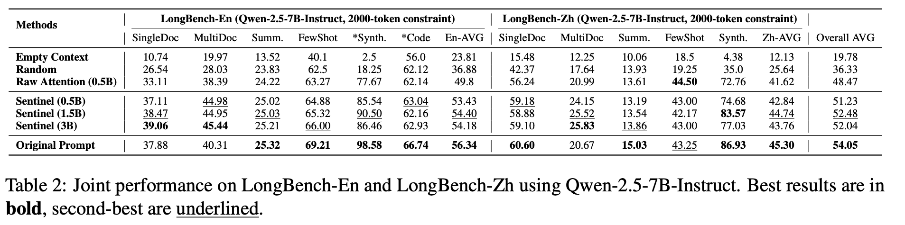

<p align="center">
<h1 align="center">Sentinel: Attention Probing of Proxy Models for LLM Context Compression

<p align="center">
    <a href="https://arxiv.org/abs/2505.23277"></a>
</p>


## 📈 Results

<p align="center">
  
</p>

<p align="center">
  
</p>

---

## 📌 Overview

**Sentinel** is a lightweight and interpretable context compression framework for Large Language Models (LLMs).  
It reformulates compression as an **attention-based understanding task**, using **decoder attention from an off-the-shelf 0.5B proxy model** to identify sentence-level, query-relevant context—**without finetuning or supervision**.

- Sentence-level compression  
- Compatible with any LLM backbone  
- Fast, model-agnostic, and scalable

---

## 🎯 Key Contributions

- **Formulation**: Reframe context compression as **attention-based query-context relevance estimation**, avoiding the need for a trained compression model.

- **Proxy-Based Attention Probing**: Introduce **Sentinel**, which leverages a compact **0.5B decoder-only LLM** to probe attention for salient sentence selection.

- **Scale-Invariant Behavior**: Show that attention-derived relevance signals are **stable across model sizes**, allowing small proxies to mimic large-model selection behavior.

- **Empirical Effectiveness**: On **LongBench** (English & Chinese), Sentinel achieves **up to 5× input compression**, matching the QA performance of **7B-scale compression baselines**.

---

## 🚀 Quick Start

### Installation

```bash
# Clone the repository
git clone https://github.com/yzhangchuck/Sentinel.git
cd Sentinel

# Install dependencies
pip install -r requirements.txt
python -c "import nltk; nltk.download('punkt')"
python -m spacy download zh_core_web_sm
```

### Demo Script

Run the included demonstration:

```bash
python demo_attention_compression.py
```

This script showcases both raw attention filtering and detector-based compression methods with sample Chinese and English texts.

---

## 📦 Model Downloads

Pre-trained Sentinel classifier is available on Hugging Face: [ReRaWo/Sentinel](https://huggingface.co/ReRaWo/Sentinel)

---


## 📬 Contact

- **Email**: zhangyong.chuck@gmail.com

---

## 📎 Citation

If you find our work helpful, please cite:

```bibtex
@misc{zhang2025sentinelattentionprobingproxy,
      title={Sentinel: Attention Probing of Proxy Models for LLM Context Compression with an Understanding Perspective}, 
      author={Yong Zhang and Yanwen Huang and Ning Cheng and Yang Guo and Yun Zhu and Yanmeng Wang and Shaojun Wang and Jing Xiao},
      year={2025},
      eprint={2505.23277},
      archivePrefix={arXiv},
      primaryClass={cs.CL},
      url={https://arxiv.org/abs/2505.23277}, 
}
