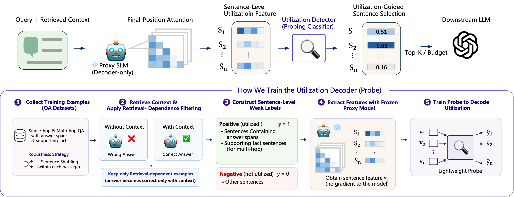
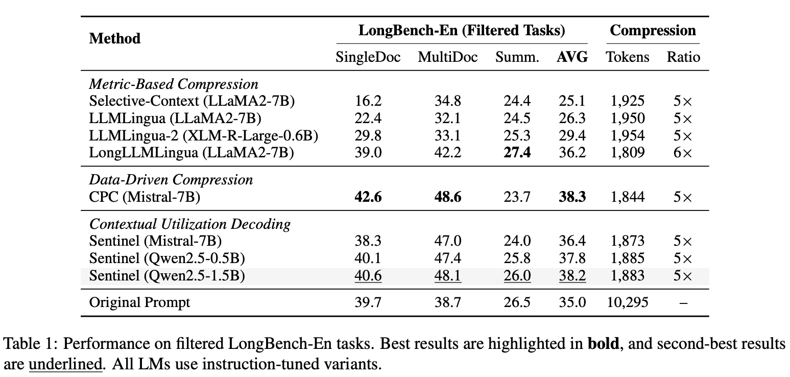
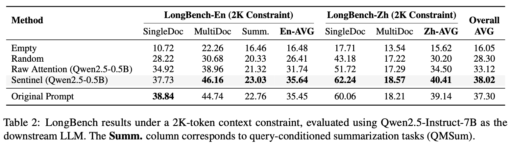

<p align="center">
<h1 align="center">Sentinel: Decoding Context Utilization via Attention Probing for Efficient LLM Context Compression</h1>
</p>

<p align="center">
    <a href="https://arxiv.org/abs/2505.23277"></a>
</p>

<p align="center">
<b>Don't estimate relevance. Decode utilization.</b>
</p>

---

## 📌 Overview

<p align="center">
  
</p>

**Sentinel** compresses long RAG contexts by decoding how a frozen LLM utilizes context during inference.

Instead of estimating which sentences appear important, Sentinel identifies which sentences the model is actually likely to use. A lightweight probe decodes these utilization signals directly from the internal attention dynamics of a frozen LLM, enabling efficient sentence-level compression in a single forward pass.

### Core Idea

Current context compression methods operate outside the model: they assign scores to sentences and decide what to keep.

Sentinel takes a different perspective:

> The model already knows how it will use the retrieved context.  
> We simply decode that behavior.

### Highlights

- ⚡ **Single forward pass** compression
- 🧠 Frozen **0.5B** proxy model
- 🏆 Competitive with **7B-scale** compression systems
- 🌏 Strong English → Chinese transfer
- 📚 Robust generalization across LongBench tasks

---

## 📈 Results

<p align="center">
  
</p>

<p align="center">
  
</p>

### Compression Efficiency

**Dataset:** LongBench **MultiFieldQA-Zh** (`multifieldqa_zh`) · **n=200** samples (mean)  
**Setup:** A800 80GB · batch size 1 · max input **10,240** tokens · **2,000**-token compression budget

| Method | Runtime (mean) |
|:-------|---------------:|
| Generative Compression (HF, Qwen2.5-7B) | 40.6 s |
| Generative Compression (vLLM, Qwen2.5-7B) | 27.4 s |
| **Sentinel (Qwen2.5-0.5B)** | **74.6 ms** |

> **Over 300× faster** than generation-based compression (vs. vLLM 7B: 27.4 s → 74.6 ms) using only a frozen 0.5B proxy model. Sentinel MFQA-Zh score: **62.48** (same setting).

Demo (single run, 4,700 tokens): **0.06 s** compress latency on A800.

### Key Results

- Up to **5× compression** on LongBench
- Competitive with compression systems built on **7B-scale models**
- Strong transfer from **English training** to **Chinese evaluation**
- Effective across QA, summarization, reasoning, and code tasks

---

## 🎯 Why Sentinel?

Most compression methods attempt to identify which sentences are important.

Sentinel instead identifies which sentences the model is likely to use.

This distinction is subtle but important:

```text
Importance Estimation  ≠  Context Utilization
```

By decoding utilization directly from the model's internal behavior, Sentinel avoids expensive autoregressive compression while preserving strong downstream performance.

---

## 🚀 Quick Start

### Installation

```bash
# Clone the repository
git clone https://github.com/yzhangchuck/Sentinel.git
cd Sentinel

# Install dependencies
pip install -r requirements.txt
python -c "import nltk; nltk.download('punkt')"
```

> Optional: `python -m spacy download zh_core_web_sm` if you disable `use_fast_chinese_split` in `AttentionCompressor`.

### Demo Script

This release includes a **Yao Ming Wikipedia article** demo (4,700 tokens, Chinese QA):

```bash
python demo_attention_compression.py

# Batch demo (same article, 4 different questions)
python demo_attention_compression_batch.py
```

Place the pre-trained detector under `models/detectors/` (see [Model Downloads](#-model-downloads)).  
Expected on A800: **80% compression**, **0.06 s** wall time (SDPA prefill + last-row attention probe).

### Repository Layout

```
.
├── README.md
├── requirements.txt
├── attention_compressor.py       # AttentionCompressor
├── demo_attention_compression.py       # Single-sample demo
├── demo_attention_compression_batch.py # Batch demo (4 questions)
├── probe/                        # Qwen2 last-row probe (SDPA)
├── assets/                       # Method figure & result tables
└── models/detectors/             # Trained detector (.pkl)
```

---

## 📦 Model Downloads

Pre-trained Sentinel classifier is available on Hugging Face: [ReRaWo/Sentinel](https://huggingface.co/ReRaWo/Sentinel)

Download and place the detector file, e.g.:

```
models/detectors/qwen2.5-0.5b-instruct-3000_all_layer_last_token_qwen2_20250507_212739_model.pkl
```

At runtime, Hugging Face will auto-download:

- `Qwen/Qwen2.5-0.5B-Instruct` — attention proxy model

**GPU (CUDA) recommended.**

---

## 💻 API Example

```python
from attention_compressor import AttentionCompressor

compressor = AttentionCompressor(
    attention_model_path="Qwen/Qwen2.5-0.5B-Instruct",
    detector_path="models/detectors/qwen2.5-0.5b-instruct-3000_all_layer_last_token_qwen2_20250507_212739_model.pkl",
    max_seq_len=None,
    use_probe_attention=True,
    probe_attn_implementation="sdpa",
    use_pure_gpu=True,
    use_fast_chinese_split=True,
)

result = compressor.compress(
    context="...",
    question="姚明受过几次伤",
    compression_rate=0.8,
    context_type="chinese",
)
print(result["compressed_text"])
```

---

## 📬 Contact

- **Email**: zhangyong.chuck@gmail.com

---

## 📎 Citation

If you find our work helpful, please cite:

```bibtex
@misc{zhang2026sentineldecodingcontextutilization,
      title={Sentinel: Decoding Context Utilization via Attention Probing for Efficient LLM Context Compression}, 
      author={Yong Zhang and Heng Li and Yanwen Huang and Ning Cheng and Yang Guo and Yun Zhu and Yanmeng Wang and Shaojun Wang and Jing Xiao},
      year={2026},
      eprint={2505.23277},
      archivePrefix={arXiv},
      primaryClass={cs.CL},
      url={https://arxiv.org/abs/2505.23277}, 
}
```
